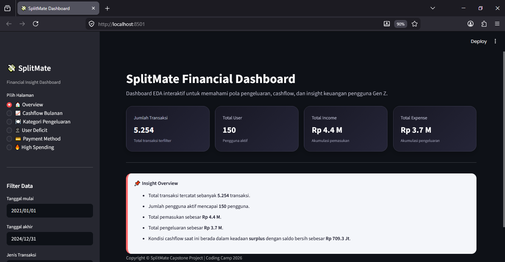

# 💸 SplitMate Financial Dashboard

---

# 📌 Deskripsi Project
SplitMate Financial Dashboard merupakan dashboard interaktif berbasis Streamlit yang digunakan untuk melakukan Exploratory Data Analysis (EDA) terhadap data transaksi keuangan pengguna.

Dashboard ini membantu pengguna memahami pola pemasukan, pengeluaran, cashflow, metode pembayaran, kategori pengeluaran, serta perilaku transaksi berdasarkan waktu dan pengguna.

---

# 🖼️ Preview Dashboard


---

# 🎯 Tujuan Project
Project ini dikembangkan sebagai bagian dari Capstone Project Coding Camp 2026 untuk mendukung platform **SplitMate**, yaitu aplikasi manajemen keuangan kelompok berbasis AI.

Dashboard digunakan untuk:
* Menganalisis pola transaksi pengguna.
* Memantau kondisi cashflow.
* Mengidentifikasi kategori pengeluaran terbesar.
* Menemukan pengguna dengan kondisi defisit.
* Mengevaluasi metode pembayaran yang paling sering digunakan.
* Memberikan insight yang dapat digunakan dalam pengembangan fitur AI pada SplitMate.

---

# ⚙️ Teknologi yang Digunakan
| Tools      | Keterangan                |
| ---------- | ------------------------- |
| Python     | Bahasa pemrograman utama  |
| Streamlit  | Framework dashboard       |
| Pandas     | Data processing           |
| Matplotlib | Data visualization        |
| Seaborn    | Statistical visualization |

---

# 📁 Struktur Folder
```text
Capstone/
│
├── dashboard/
│   ├── dashboard.py
│   ├── cleaned_finance_data.csv
│   └── screenshot_dashboard.png
│
├── README.md
└── requirements.txt
```

---

# 🚀 Menjalankan Project
## 1. Masuk ke Folder Project
```bash
cd Capstone_Dashboard
```

## 2. Install Dependency
```bash
python -m pip install -r requirements.txt
```

## 3. Masuk ke Folder Dashboard
```bash
cd dashboard
```

## 4. Jalankan Dashboard
```bash
python -m streamlit run dashboard.py
```

## 5. Buka Dashboard
Jika berhasil, Streamlit akan berjalan pada browser:
```text
http://localhost:8501
```

---

# 📊 Fitur Dashboard
### 🏠 Overview
Menampilkan:
* Total transaksi
* Total pengguna
* Total income
* Total expense
* Insight kondisi cashflow

### 📈 Cashflow Bulanan
Menampilkan:
* Tren income dan expense bulanan
* Aktivitas transaksi harian
* Perbandingan weekday vs weekend
* Surplus / defisit bulanan

### 🍽️ Kategori Pengeluaran
Menampilkan:
* Total pengeluaran per kategori
* Jumlah transaksi per kategori
* Insight kategori dominan

### 👤 User Deficit
Menampilkan:
* Top 10 pengguna dengan defisit terbesar
* Insight kondisi cashflow pengguna

### 💳 Payment Method
Menampilkan:
* Frekuensi penggunaan metode pembayaran
* Total nominal transaksi per metode pembayaran

### 🔥 High Spending
Menampilkan:
* Analisis transaksi pengeluaran besar
* Tren high spending
* Perbandingan weekday dan weekend

---

# 📄 Dataset
Dataset utama yang digunakan:
```text
cleaned_finance_data.csv
```

Kolom utama dataset:
```text
transaction_id
user_id
date
transaction_type
category
payment_mode
location
notes
amount_idr
```

---

# 📦 Dependencies
Seluruh dependency project dapat diinstal menggunakan:
```bash
pip install -r requirements.txt
```
File dependency tersimpan pada:
```text
requirements.txt
```

---

# 🛠️ Troubleshooting
## ❌ ModuleNotFoundError
Install ulang dependency:
```bash
pip install -r requirements.txt
```

---

## ❌ File CSV tidak ditemukan
Pastikan file berikut:
```text
cleaned_finance_data.csv
```
berada di dalam folder:
```text
dashboard/
```

---

## ❌ Streamlit tidak dikenali
Install Streamlit dengan perintah:
```bash
pip install streamlit
```
atau:
```bash
python -m pip install streamlit
```

---

# ✨ Penutup
Dashboard ini dikembangkan sebagai bagian dari Capstone Project SplitMate untuk membantu pengguna memahami kondisi keuangan mereka melalui visualisasi data yang interaktif dan mudah dipahami.

**Author:** Tim SplitMate
**Project:** SplitMate Capstone Project - CC26-PSU310
**Program:** Coding Camp 2026
